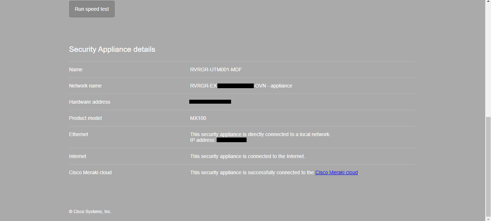
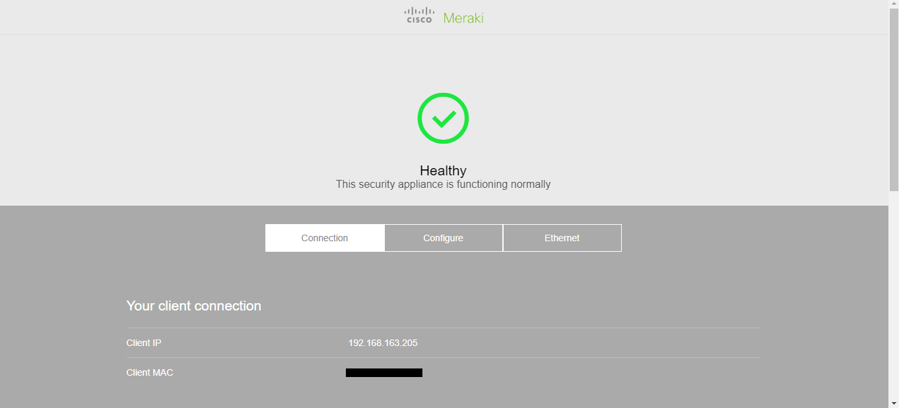
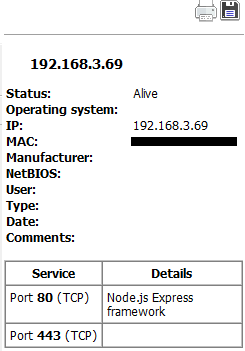
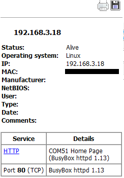
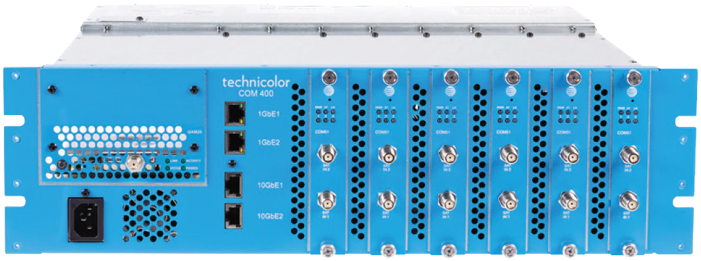
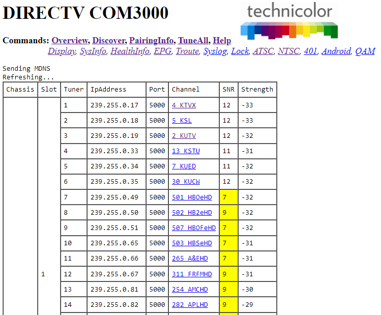

---           
title: The Brain of A Hotel - ~~Hacking~~ *Inspecting* the Tech Inside Hotels
date: 2022-07-07 21:36:31 UTC
updated: 2022-07-07 21:36:31 UTC
comments: false
categories: hacking
tags: embedded smart-device-hacking networking 
---

## NOTE: The contents in this post are for educational purposes. Do not attempt any of the actions outlined here. You could get banned from hotels, fined, and make an IT guy's job a lot harder.

I recently stayed at a couple of hotels over the summer and as always I had to see what tech powered them.

Both hotels were clean and I had a good stay except for the [unexpected wakeup call.](#unexpected-wakeup-call)

The first hotel (I'm keeping company names private for now) provided complimentary TV, but no free WiFi.
A way to remedy this was to use an ethernet outlet in the room. One was being used for the Set Top Box and had what looked like an anti-theft connector.
Upon closer inspection this was just to make sure no one got free internet. By simply sliding the room card under the lock and pressing back the prong on the RJ-45, it came free, and so did the internet. Full connection to the network.

I did not find very much on the network at this hotel apart from the other Set Top Boxes sending dlna junk around. 
Unfortunately I refrained from further research on this hotel apart from noting the android-tv like interface on the television.

Hotel number 2 had a lot more to offer. Having just been built around a year before, tech was cutting edge... or attempted to be.
I like what I saw in this setup. From the TV you could view your current bill, view and change the room temperature, and of course watch TV.

The TV seemed to be an LG NanoCell hospitality model that ran a modified WebOS specific for hotels.
The only ports used was power (obviously), an ethernet port, and... a Chromecast?
A neat added feature was casting to the TV. It turns out that they just slapped a Chromecast on the back and called it a day.
They plugged it into the TV via a USB cable and the HDMI. It was also secured via an anti theft box which was just held on by phillips screws.
You could select casting in the TV menu and it would switch to HDMI 2 - the port the Chromecast was connected to.
Even being an official Google Chromecast I could not display anything but a black screen anytime I connected.
I tried from multiple devices, but still got nothing. 
However, I will give them credit for trying. Casting is, I believe, a very needed feature in hotels, because who wants to login to their Netflix on a sketchy hotel TV anyway?
But casting is hard, manily due to closed protocols, pricy software, and the many standards different devices use.

The other features on the TV included free movies to stream. There was a single app which seemed to briefly show the WebOS web browser icon. 
I am not sure if it was the hotel's local movie streaming site, or an online service, but the name was very vague and I didn't have my packet capture equipment with me (an old network hub).
There was no other streaming options. I wouldn't have logged into any of my accounts anyway, but at least they could have added YouTube or a web browser!
While many of the buttons on the remote were disabled, the input button worked, allowing you to connect a device to HDMI. Most other hotels disable that feature and I end up having to rip out the Set Top Box and connect my computer to that.
The TV was mounted on a movable wall mount allowing for access behind. In the wall was a Cisco AP with a built in switch that connects to the TV.
There were two ethernet ports for guests in the room. One above a desk and one by the tv. 
There was also an RJ-45 jack being used as an RJ-11 for the POTS phone? 
I guess RJ-11 jacks are getting harder to find.
The jack above the desk worked the same as the guest WiFi, requiring a login to access the network. The port near the TV wasn't even connected to anything!

### The Network
I didn't have much time in this hotel, nor did I bring my network hub so no packet sniffing from the TV.
I did do a bit of network scanning and general broadcast address sniffing.

I checked the DHCP server and sure enough it was running a webserver (lighttpd 1.4.55). The firewall is a Cisco Meraki MX100.
From the status page there wasn't much and fortunately the default password of these Cisco firewalls is the serial number.
This means it was *probably* safe.

*Firewall Information*

*Landing Page of Cisco Security Appliance*

There were many subnets in which I did not have time to scan them all. I picked a few interesting ones.
The WebOS TVs on the network had an exposed NodeJS webserver most likely for remote management and communication. I got a 404 when accessing them and I could not find anything else on it. If I had more time I could probably shut off everyone's TVs or something.

*Portscan of a WebOS TV*

This is probably one of the most interesting devices I found.
When I looked through the scan results I found this:

After going to the webpage I discovered that the device was a Technicolor DIRECTV COM3000. 
This is an IPTV headend system. Having worked with TVHeadend on my homelab I was a bit familiar with headends and IPTV, but this was much more advanced.

*The technicolor COM3000 (Also displayed as COM400)*
[Image Source](https://pdihospitality.com/products/directvs-hd-com-system)

These devices use COM51 (as seen in the portscan) blade cards to connect to what looks like coax connections. There also seems to be 10 gigabit ethernet connections which are required to stream live video to every television.

There were multiple results for these "COM51" webpages in the portscan which I'm assuming is a separate webserver for every card rather than multiple rackmount units.
One of the web UIs did not have a password set.

*Information page for COM3000*

*Channel List*

Yes, this meant I could mess around with every setting. Switch people from watching CNN to Fox News and vice versa. But as I said I was just here to spectate and find what technology was being used. Also most of the settings were beyond my knowledge of cable/satellite technology and were probably meant for DIRECTV technicians. 

This technology is nice to see however. (As long as it's secure!) We are heading towards coax and tuning being obsolete if we aren't already there. One of these units can be very efficient. For instance coax cables no longer need to be run. Everything streams via the network. 
You can give guests with premium access extra channels. Maybe families who request it will only get kid-friendly channels. With digital streaming many possibilities open up.
[Here is even a page on the COM3000 in hospitality environments.](https://www.sonusatellite.com/directv-com3000-headend-tv-system/)

Maybe next we will see the analogue phone lines in hotels turn to IPBX systems?

## Conclusion
That was about all I found, I might revise this and add more information. If I had more time I would have searched deeper, but I still find it interesting to see the technology that hotels use as well as their insecurities.

### Unexpected Wakeup Call

During the stay at the second hotel at about 10:30 PM I heard a sound and it took me a minute to realize that the fire alarms had been set off. So we left the room went down the stairs all the way around to the front. Asked the employees weather it was a false alarm. One said "maybe" and the other said "yeah" and silenced the alarm at the annunciator in the front. Fortunately there was no strobe in the room as it was only silenced.

The fire department didn't even arrive and they reset the alarm themselves. I'm not sure about the legal terms of that, but we had to hit the road early the next morning. I looked at the panel the next day and it said trouble in room 220. So thanks person in room 220.
I'm not into the technical details of fire suppression systems, but it was interesting to see the fans in the stairwells made to exhaust smoke and/or heat as well as the other interesting systems in use.
But other than that it was a clean, new hotel and we had a good stay.
